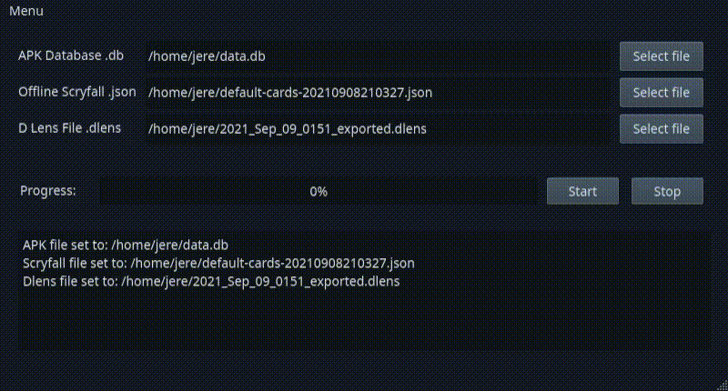

# dlensExporter
Python GUI program to convert .dlens files from Delver Lens N mobile application into .csv format to allow importing into various sites and platforms. 

  

## Usage

You need three files:

* data.db from /res/raw/ in Delver Lens N APK, you can obtain this by extracting the APK downloadable for example from https://apps.evozi.com/apk-downloader/?id=delverlab.delverlens.
* .json file with offline card data from Scryfall, downloadable from https://scryfall.com/docs/api/bulk-data, Default Cards should suffice for most cases.
* .dlens file from Delver Lens N through it's backup or export deck option.

Clone the repository and install necessary dependecies. Under releases I have included pre-compiled binaries but due to included dependencies they're quite large.
    
## Notes

* Currently only supports Deckbox .csv format. There are some differences between what Scryfall API provides as card or set names, and some of these are automatically converted. I have added some I've come across myself, but it's not all-inclusive.
* Linux binary is compiled against glibc 2.33 and that or newer is required.
